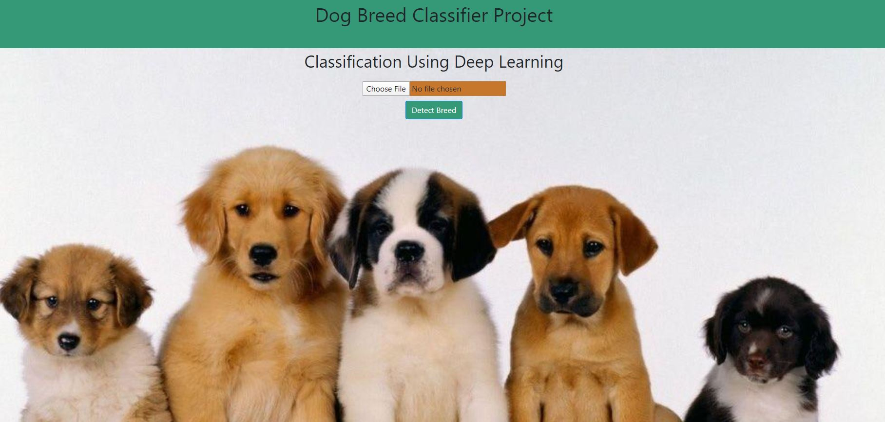
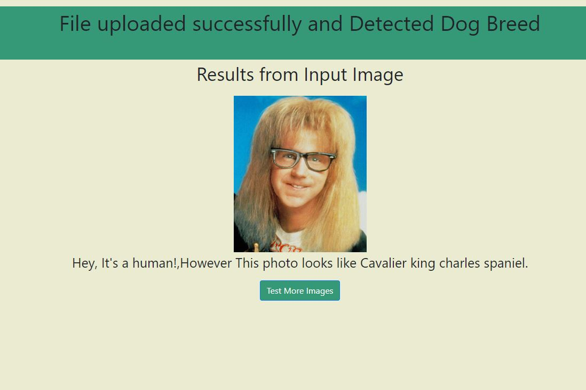
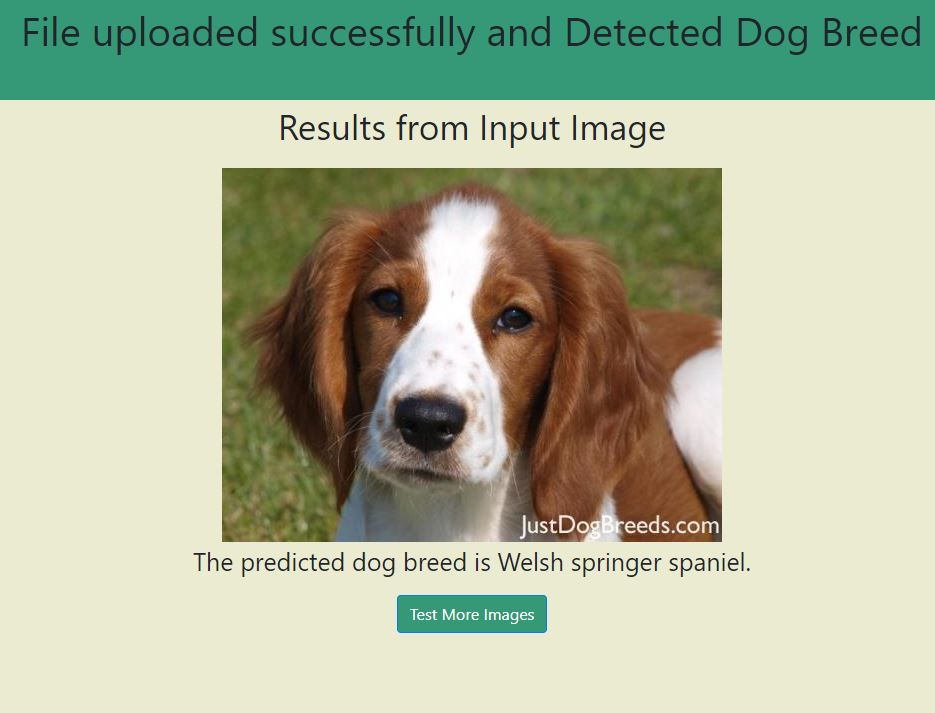

# DSND_Dog_Breed_Classifier

## Project Overview and Motivation

The project involves Image Processing using Deep learning. Convolutional Neural Networks along with Transfer Learning is used to deliver the results. Given an image of the dog, the CNN must give out the correct breed of the dog in the image out of 133 classes of dogs.
The aim of this project is to create a classifier that is able to identify a breed of a dog if given a photo or image as input. If the photo or image contains a human face, then the application will return the breed of dog that most resembles the person in the image. I decided to opt for this project as I found the topic of Deep Neural Networks to be very fascinating and wanted to dive deeper into this with some practical work.

## File Description
~~~~~~~
DSND_Dog_Breed_Classifier

  |-- static 
        |-- style
        |-- images
  |-- templates
        |-- file.html
        |-- success.html
  |-- main.py
  |-- dog_app.ipynb
  |-- dogs_name.json
  |-- data
        |-- disaster_message.csv
        |-- disaster_categories.csv
        |-- DisasterResponse.db
        |-- process_data.py
        |-- ETL Pipeline Preparation.ipynb
        |-- Twitter-sentiment-self-drive-DFE.csv
  |-- saved_models
        |-- weights.best.Resnet.hdf5
        |-- weights.best.VGG16.hdf5
  |-- README
  |-- bottleneck_features
  |-- haarcascades
  |-- requirements.txt
~~~~~~~
  
### Instructions:

•	Make sure you have all necessary packages installed from requirements.txt.

•	Git clone this repository
```
git clone https://github.com/imadarsh1001/DSND_Dog_Breed_Classifier.git
```
•	Within command line, cd to the cloned repo, and within the main repository.

•	Run the main.py in the parent directory to run the web application.

•	Go to http://127.0.0.1:8080/ to view the web app and input new pictures of dogs or humans – the app will tell you the resembling dog breed.


## Steps Involved:

1)	Import Datasets.
2)	Detecting humans in the input image.
3)	Detecting dogs in the input image. 
4)	Create a CNN to Classify Dog Breeds (from Scratch). 
5)	Using CNN to make predictions using Transfer Learning. 
6)	Creating own model of CNN to classify dog breeds using Transfer Learning. 
7)	Writing the algorithm. 
8)	Testing the Pipeline. 
9)	Using the model to make predictions from a web application using Flask. 
10)	The user can select any image to test and the backend will make out the prediction and display the results on the next page.

## Snapshots

# 1 Homepage 


# 2 Result Pages




## Conclusion 

Because of the transfer learning, I had the option to prepare a model with the generally small dataset, and accomplished really great accuracy. Moreover, the model was prepared inside a brief timeframe, which is very proficient. The fundamental explanation is we can reuse the loads prepared by AI specialists utilizing a great many pictures.
There are a couple of potential enhancements for the model. To begin with, the parameters of completely associated layers, for example, the number of layers, number of hubs, dropout rates, may be changed to show signs of improvement results. Second, utilizing an alternate analyzer or assessment metric may likewise improve model execution. Third, information expansion could likewise improve the last model exactness, as it will produce all the more preparing information.

## Licensing and Acknowledgements

Credit to Udacity Data Science Nanodegree for the knoweldge and for the data. Feel free to use the code here as you would like following the instruction in the LICENSE.txt
